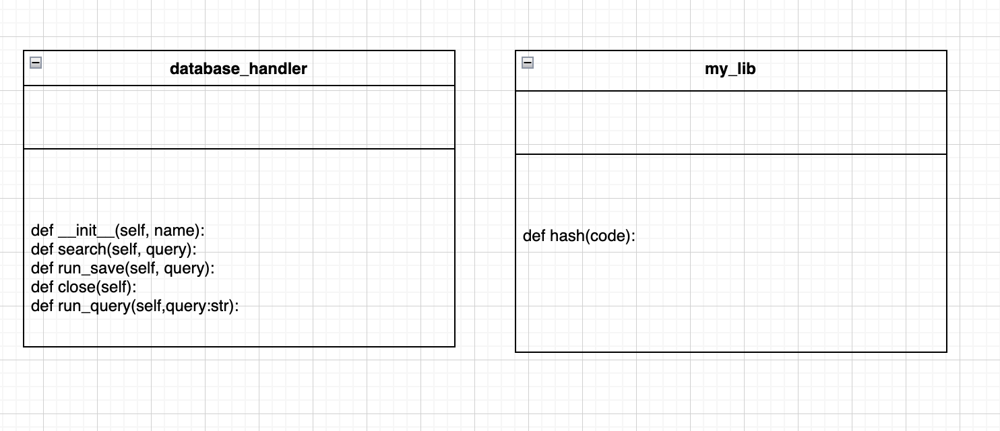

# IA
# Unit 4 Project: Game review app


## Criteria A: Planning

## Problem definition(Client identification)
My client is a grape farmer. He is willing to have a system that will give transparency to his product. He wants his customers to have access to more information about his product. The information will be the general grape information(eg. sweetness, production area), cultivation history, and pest control history. My client is working as a group of grape farmers. Therefore, he also wants to share information about each producer in the group. 
However, there are several issues when implementing this system. First, the client is currently keeping his product data in an Excel file. However, in order to use the data in the system, the data needs to be transferred into a database but the client has no knowledge to do that. Secondly, he does not have a system that could store and manage information about each grape and producer. Lastly, the current situation is that there are no easy methods for the customer to access this information.
By having this system my client’s customers will have enough information to ensure the quality and safety of my client's product. This is very important in order to add transparency to his products.


## Proposed Solution
To tackle the problem defined above, I proposed to create a grape traceability system. Traceability refers to the ability to identify, track, and trace a product as a customer. 

The product will be delivered in the shape of a web application. As the stored data would need to be accessible from multiple stakeholders, the product needed to be hosted on the internet. Considering how the system will be used, it is obvious that the system needs to have mutual interaction with the client. Therefore, a web application would suit this system the most.

The back end of the product will be developed by Python. An alternative to this would be JavaScript. However, python is better as it has, better readability which gives more extensiveness, it is supported by powerful web development frameworks (Django, Flask) that simplify backend tasks and it has a higher security as its frameworks have more built-in security features.   Flask will be used to host the website. It is because it offers simple and high-speed performance compared to others. Also, it is very python friendly compared to alternatives. This is why the flask was chosen among other alternatives. For data storage, we will use SQLite, known for its proficiency in handling small to medium HTTP requests. It also has the ability to function independently after installation. For the front end (UI), we will create it by using HTML and CSS. It allows us to design and structure the website in detail.

In this system, there will be two stakeholders, the producer and the customer. By using this the producer will be able to manage their product information more effectively and easily. For the customers, the system will allow them to have easy access to a great amount of information about the product, thus greater transparency of the product.


[^3]:Ijaz, Arslan. “JavaScript Vs. Python: Which One is Better? | by Arslan Ijaz | CodeX.” Medium, 20 September 2022, https://medium.com/codex/javascript-vs-python-which-one-is-better-b873f4e69583. Accessed 19 May 2023.

[^4]:Shah, Hardik. “6 Reasons Why Flask is Better Framework for Web Application Development.” Able, 1 December 2021, https://able.bio/hardikshah/6-reasons-why-flask-is-better-framework-for-web-application-development--cd398f73. Accessed 19 May 2023.

[^5]:SQL is 43 years old - here's 8 reasons we still use it today.” Blog, 28 April 2017, https://blog.sqlizer.io/posts/sql-43/. Accessed 19 May 2023.

[^6]:Goyal, Yashi. “Advantages of HTML | Top 10 Amazing Advantages of HTML.” eduCBA, https://www.educba.com/advantages-of-html/. Accessed 19 May 2023.

[^7]:“What Is CSS and Why Should You Use It?” Devmountain, https://devmountain.com/blog/what-is-css-and-why-use-it/. Accessed 19 May 2023.


## Success Criteria
| No. | Success criteria	         | Issue tackled       |
|----------------------------|---------------------------------|----------------|
| 1 | The system will have a secured data managing screen for the producer.  | "he does not have a system that could store and manage information about each grape and producer."(This will only give the producer the access to modify stored data.)  | 
| 2 | The client will be able to manage its grape info and producer info. | "he does not have a system that could store and manage information about each grape and producer." | 
| 3 | The program will add the collected data to the database.  | " the data needs to be transferred into a database but the client has no knowledge to do that"  | 
| 4 | The customer can access the information about the grapes and producer.  |"he also wants to share information about each producer in the group.","He wants his customers to have access to more information about his product" | 
| 5 | The customer can access the information about the grape through a barcode.  | "the current situation is that there are no easy methods for the customer to access this information." | 
| 6 | The customer can access the information about the grape by searching with the grape ID. | "the current situation is that there are no easy methods for the customer to access this information.” | 


# Criteria B: Design

## System Diagram

## Data Storage

## UML Diagram

## Wireframe


## Record of Tasks
| Task No  | Planned Action  | Planned Outcome | Time estimate  | Target completion date  | Criterion |
|:----------|:-------------------------|:----------|:----------|:----------|:----------|
| 1  | Planning: Writing the problem definition | Record the problem definition in the repository | 30 mins  | 2023.07.20    | A   |
| 2  | Planning: Write down the success criteria | record the success criteria and how they refer to the problem definition  | 30 mins  | 2023.07.20    | A  |
| 3  | Design: Create a prototype wireframe and ER diagram |  Get a specific idea of what the website will look like   | 30 mins  | 2023.07.20    | B |
| 4  | Development: Coding the template page with html|  Get a specific design for the heading and sidebar which is common through the customer page.   | 30 mins  | 2023.07.20    | C |
| 5  | Development: Create database in SQL |  Create all database needed in the website   | 30 mins  | 2023.07.21    | C |
| 6  | Development: Coding the info block |  Get a specific design of the info block   | 30 mins  | 2023.07.21    | C |
| 7  | Development: Coding the history block |  Get a specific design for the history screen   | 30 mins  | 2023.07.21    | C |
| 8  | Development: Create the function for the info block |  Get a functional maker block that shows the info of the grape.   | 30 mins  | 2023.07.22    | C |
| 9  | Development: Create the function for history block |  Get a functional history block where you can see the planting history of the grape   | 30 mins  | 2023.07.22    | C |
| 10  | Development: Create the function for the template |  Get a functional template where you can switch between info block and history block   | 30 mins  | 2023.07.22    | C 
| 11 | Development: Coding the Login Screen for producer |  Get a specific design for the Login page  |35 mins  | 2023.07.24    | C 
| 12 | Development: Create the function for Login |  Get a functional Login Screen that secures access to the producer page.   | 30 mins  | 2023.07.25    | C |
| 13 | Development: Coding the producer screen |  Get a specific design for the producer page   | 45 mins  | 2023.07.25    | C 
| 14 | Development: Create the function for producer Screen |  Get a functional producer page where you can add and remove data from the database.   | 30 mins  | 2023.07.25    | C |
| 15 | Development: Create the searching function |  Create a search bar and make it functionable.  | 30 mins  | 2023.07.26    | C |
| 16 | Development: Finish all the CSS |  Finish the design of the UI  | 30 mins  | 2023.07.26    | C |
| 17 | Design: Complete the UML diagram |  Show relation of classes  | 30 mins  | 2023.07.27    | B |
| 18 | Design: Complete the flow diagram |  Create three flow charts  | 60 mins  | 2023.07.27    | B |
| 19 | Design: Complete the ER diagram |  Show relation between databases  | 30 mins  | 2023.07.28    | B |
| 20 | Design: Complete the wireframe |  Show relations between each screens and how it works  | 30 mins  | 2023.07.28    | B |
| 21 | Alpha Testing: Test overall functionality of the system      | To test the comprehensive functionality and to have the evidence documented              | 1hr           | 2023.07.29        | E         |
| 22 | Implementation: Evaluation by client                      | To have the website evaluated by the client and to have the evidence documented                                  | 1hr           | 2023.07.29        | E         |
| 23 | Beta Testing: Evaluation by peer                          | To have the website evaluated by a peer and to have the evidence documented                                      | 1hr           | 2023.07.29        | E         |
| 24 | Implementation: Collect Recommendations from client/customer | To have taken in recommendations from both stakeholders on how the system can be improved | 15min         | 2023.07.29          | E         |


## Flow Diagrams
### login function


### add data function


### search function

## Test Plan
| Instruction    | Category     | Input example / code   | Description  | Expected output | Success criteria |
|----------------|--------------|------------------------|--------------|-----------------|------------------|
|Test the login   | Unit testing  | password: grape  | The user is able to log into the application and the producer side screen is displayed when they enter | The user logs in if the password is correct and the producer side screen is displayed with a cookie being created as well(The password is for testing)   |2, 3 | 
|Test the login with wrong password | Unit testing  | Password: melon (wrong password) | The user inputs the wrong password when trying to login | Error message shows the password is wrong | 2  |
|Test the data input for the producer| Unit testing  | input: 16.6, John, muscat, Karuizawa, 6/6, 2,6,7/8, 598.3, 7/8 | Try to input general grape info | info will be added to database | 2  |
|Test the login, data input, and home screen  | Integration testing   | Password: grape  data_input: 18.1,エバーグリーン北杜,シャインマスカット,山梨県北杜市,8/8,2,5,9/24,600.0,9/26 \n 0,tanaka,明日,美味しい,葡萄、メロン,/static/image/img.png| The producer side is able to log in, letting them go to the home screen where they are able to manage data inputs. The consumer side can see data on grapes in the info and history screen | The producer is able to log in and modify data. The CSV before \n will be stored in the info table and the CSV after \n will be stored in maker tavle.The consumer can access the home screen and see the grape data.  | 1, 2, 3, 6 |
| Test the search function  | Unit testing  | id searched in search bar 0   | The user inputs a valid id in the search bar which searches the database   | It shows the information of the grape with the same id |  5 |


# Criteria C: Development

## Existing Tools
| Software/Development Tools | Coding Structure Tools          | Libraries      |
|----------------------------|---------------------------------|----------------|
| PyCharm                    | Encryption                      | Flask          |
| Relational databases       | Objects, attributes and methods | sqlite3        |
| SQLite                     | If statements                   | passlib        |
| Python                     | for loops                       |                |
| Chat GPT                   |                                 |                | 
## List of techniques used

1. Flask library/routes
2. For loops
3. If statements
4. Password hashing
5. Interacting with databases
6. Lists
7. Cookies
8. json token


## Success criteria
### 1 The system will have a secured data managing screen for the producer.

The client requested a data managing screen for the producer side. In order to give access only to the producer side we created a simple login system. As the producer side is supposed to be used only by the client, I decided to make the login function that only requires the password but not the username.

### 2 The client will be able to manage its grape info and producer info.


### 3 The program will add the collected data to the database.

The client requested a function that will add csv data to the database. The data will be input in the HTML input box. Both grape data and producer data could be added here.
```.py
    if request.method == 'POST':
        print('St')
        csv_text = request.form['myInput']
        line = csv_text.split('\n')
        db = database_handler("grape.db")

        for b in line:
            i = b.split(',')
            print(i)
            if len(i) == 10:
                sweet, maker, type, location, planting, area, pot_num, date, weight, check_date = i[0],i[1],i[2],i[3],i[4],i[5],i[6],i[7],i[8],i[9]
                print(sweet, maker, type, location, planting, area, pot_num, date, weight, check_date)
                query = f'INSERT INTO info(sweet, maker, type, location, planting, area, pot_num, date, weight, check_date) values ("{sweet}","{maker}","{type}","{location}","{planting}","{area}","{pot_num}","{date}","{weight}","{check_date}")'
                db.run_query(query)
            elif len(i) == 5:
                maker,word,quote,product,image = i[0],i[1],i[2],i[3],i[4]
                query = f'INSERT INTO maker(maker,word,quote,product,image) values ("{maker}","{word}","{quote}","{product}","{image}")'
                db.run_query(query)

        db.close()
```
This is the code for this function. When it gets a request, by splitting with \n, the variable line will get a list of CSV in every row. For every line of the CSV if the length is ten then each csv will be added as grape info, if the length is 6 then each csv will be added as producer info into the database. It means the client can mix both data in one and the code will automatically distribute it to the right table. 

### 4 The customer can access the information about the information of grape and producer.
The client requested a feature that allows customers to see the information about the grapes they bought. Two main information that needs to be provided is the general info and cultivation history. In order to create the UI for this I used a template and block system:
eg. summary of history.html
```.html



    HTML code for history block is supposed to be here


```
summary of template.html
```.html
<!DOCTYPE html>
<html>
<body>
    <div class="content">
        
    </div>
</body>
</html>

```
When this file is loaded into the browser the variables in the file and the base template are put together and displayed.
This way it allows the user to go back and forth between these two tabs quickly as there is no need to change the whole page.
Using  in HTML templates allows you to create a reusable template structure where you can insert specific page content dynamically, making it easier to maintain and customize web pages. It promotes code modularity and reduces duplication.
### 5 The customer can access the information about the grape through a barcode.

In order to allow customers to easily access their grape information, we decided to put a barcode on each bunch of grapes. The barcode will represent a URL with the grape ID in the last directory. The code will refer to the id and search for grape which has the common id from the database.

This code shows how the home screen refers to the last directory from the URL and searches for necessary information.
```.py
@app.route('/home/<int:id>')
def home(id):
    result = get_info(id)

def get_info(id):
    print(id)
    db = database_handler("grape.db")
    data = db.search(f"Select * from info where id = {id}")
    print(data)
    data = data[0]
    #print(id, sweet, maker, type, location)
    return data
```

### 6 The customer can access the information about the grape by searching with the grape ID.

### Pattern recognition
### Abstraction
### Decomposition
I applied decomposition by tackling each success criteria individualy and putting it together afterwards. It made me easier to find the solution of error since individual functions makes it easier to identify the error happening.


## Problem encountered

# Criteria D: Functionality

## Demonstration Video

# Critieria E: Evaluation

## Evaluation table

### Client (Record of this is in the appendix) 
| Critieria | Met or not?        | Feedback       |
|----------------------------|---------------------------------|----------------|
|1. The user can upload their own review towards the game as a social media post. The post includes the title, publisher and content  |Met      |Met, no suggestions	|
|2. There is a login and registration page for each user  | 	Met	| Met, no suggestions		| 
|3. The user can view other social media post  | Met		| Better if you could add photos or videos of gameplay  | 
|4. Users are able to store the games they own.  | Met		| It would be great if you could make a post from your own list| 
|5. Users can search game reviews by title, post creator and publisher.  | Met		|no suggestions			| 
|6. User can have their own profile page that displays their own posts and the game they own.  | Met			| Make the user owned list look better.	| 

### Other user (Record of this is in the appendix) 

| Critieria | Met or not?        | Feedback       |
|----------------------------|---------------------------------|----------------|
|1. The user can upload their own review towards the game as a social media post. The post includes the title, publisher and content  |Met      |Met, no suggestions	|
|2. There is a login and registration page for each user  | 	Met	| Met, no suggestions		| 
|3. The user can view other social media post  | Met		| Better if you could see the other users profile.  | 
|4. Users are able to store the games they own.  | Met		| Mabye make a wish list.| 
|5. Users can search game reviews by title, post creator and publisher.  | Met		|no suggestions			| 
|6. User can have their own profile page that displays their own posts and the game they own.  | Met			| no suggestion	| 

This was after I showed this to my online gaming friend.

## Suggestions for future development

### Post from your own list
The first suggestion was to make it able to create a post from your own list. This could be done by adding a function in the profile page which will redirect to the sharing screen with the selected information(such as title and publisher).

### Images 

The second suggestion was to make it able to share photos and videos in the post. This would be useful since users will be able to give more detail on what they are mentioning in the post. For example if the user is talking about a bug in the gamr they can actualy show the video of it.


# Appendix

## Client interview (planning and design) 


*Client and the Developer agreeing to the success criteria*
## Client interview (Feedback) 

*Developer collecting feedback from client*
